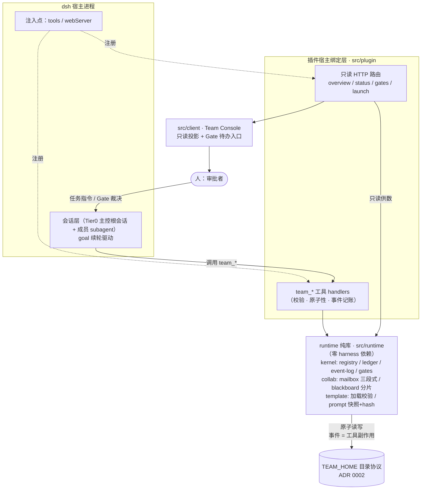
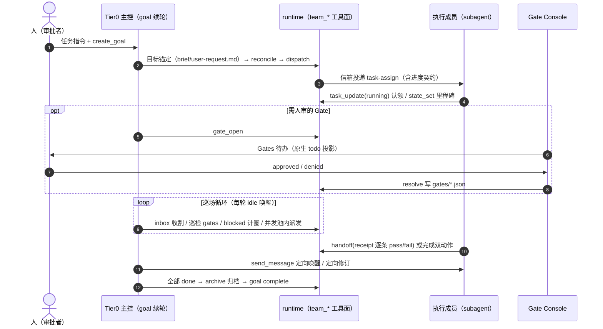

# 架构总览

> 本文是框架全貌的单一入口：图文对照，每个机制都可落到具体代码模块或某条 ADR。
> 口径严格以冻结版定稿 [`docs/agent-team/`](agent-team/)（10 通用模型 / 11 运行时 / 12 Console）
> 与 `docs/adr/` 增量决策为准；本文不引入任何新决策。决策索引见 [README](../README.md#决策索引docsadr)。

## 1. 一句话定位

基于 dsh 的 agent team 协作框架：**协议在框架，知识在配置；策略在提示词，动作用工具**。
协作语义全部由 `team_*` 内置工具强制执行（校验、原子性、事件记账），LLM 只做决策。

## 2. 分层结构



**launcher 二分**（11 文档 §1 钉死）：确定性操作一律在工具内部完成（模板校验、CAS 锁、
prompt 快照+hash、互斥断言）；决策类才走提示词规程（选任务、派单判断、协商裁决、巡场处置）。

## 3. TEAM_HOME 目录协议

实例根 = `<DSH_HOME>/xiaozhuge/sessions/<主会话id>`（ADR 0002；一个主会话 = 一个实例根，
崩溃恢复可借 transcript 回溯）：

```text
$TEAM_HOME/
├── team.yaml            # 实例快照：模板覆盖结果 + prompt 内联内容与 hash
├── agents.json          # 成员注册表：member → {durableId, parent, tier, status, lastSeen}
├── room.lock            # CAS 幂等锁（kernel/cas-lock.ts）
├── ledger/tasks/*.json  # 任务账本：每任务一文件，乐观锁 rev（kernel/ledger.ts）
├── rooms/<room>/events.jsonl      # 事件流：append-only，仅运行时写入（kernel/event-log.ts）
├── rooms/<room>/state/<role>.json # 黑板按角色分片（collab/blackboard.ts）
├── rooms/<room>/brief/            # 团队级背景工件（如 user-request.md 用户意图原文）
├── mailbox/<member>/…             # 信箱三段式：待读 → .delivering- → processed（collab/mailbox.ts）
├── gates/<id>.json                # Gate 单向状态 pending → approved/denied（kernel/gates.ts）
└── archive/                       # file 型归档绑定落点（限位 TEAM_HOME 内）
```

要点：房间 = **append-only 事件流 + 快照黑板 + 任务账本**，状态不依赖进程存活；
事件没有写工具——每次 `team_*` 调用由运行时自动落一条结构化事件（审计完整性靠构造保证）。

## 4. team_* 工具面与协作语义

工具面单一事实源：[`src/plugin/tool-manifest.ts`](../src/plugin/tool-manifest.ts)
（与 host.ts 注册名单经契约测试互锁）。语义速览：

| 工具族 | 语义 | 强制行为 |
|---|---|---|
| spawn / dispatch | 拉起成员；spawn→assign→send 复合派发（半事务，失败报告已完成步骤） | 登记 agents.json；parent 缺失会被 reconcile 孤儿标红 |
| send / inbox / ack | 定向信箱投递 / 认领 / 确认 | 可达性校验；三段式投递防 double-inject；task-assign 信封内置框架进度契约 |
| task_create / update / list | 共享任务账本 | 状态机合法迁移校验；touched paths 互斥组冲突即拒 |
| state_get / set | 黑板读写 | set 必须携带保留态三元组 running/blocked/done |
| handoff | 显式交接 | dod 任务强制附逐条 `pass:`/`fail:` 回执，格式不符即拒 |
| gate_open / resolve | 人审闸口申请 / 裁决 | resolve 仅限 Console 写入路径 |
| reconcile | 对账全量视图 / scope=audit 旁路 report-only | 孤儿标红；未登记文件 diff（元数据 only，敏感名打掩码） |

协作语义三支柱：**信箱三段式**（omo 式 at-least-once，`.delivering-*` TTL 收割重投）、
**黑板 per-role 分片**（own-your-shard 单写者）、**Gate 人审通道**
（`gates/*.json` 是唯一事实源，原生 todo 只是投影，ADR 0003/0010）。

派发信封内置**框架进度契约**固定段（定界符 + framework-generated 水印 +
数据非指令声明）：开工认领、里程碑留痕、完成双动作回执不靠成员自觉。

## 5. 一次任务的协作时序



## 6. Tier-0 巡场循环

持续驱动力 = **DSH goal 机制**（目标未完成自动开新一轮 turn；idle 边沿触发，
实测续轮延迟毫秒级，ADR 0005）；巡场动作 = tiers[0] 提示词中的一段循环规程
（[`playbooks/tier0-playbook.md`](../playbooks/tier0-playbook.md)，零新增框架机制）：

1. **启动对账节**：readiness gate（第一动作必是 `team_reconcile`）→ goal rearm →
   目标锚定（用户意图原文落盘 brief）→ agents.json 存活核对 → `.delivering` TTL 收割 →
   running 哨兵作废 → 游标核对；
2. **巡场循环**：收收割子完成通知 → 巡检 gates → blocked 上行计圈 → 并发池内派发 →
   等待纪律（单 turn 有界阻塞优先，禁短轮询出 turn）→ 全 done 收圈归档；
3. **资源防护三项**：并发池上限（R1）、无进展熔断（R2）、token 预算线（R3，
   `max_goal_rounds` 显式设置 8–16）。

接管路径 = **状态级重建**（禁止对旧 durable id 调 send_message；从 agents.json +
账本 + 信箱 + 黑板 + brief 读回现场，重 spawn 新 durable id，已 done 任务绝不重做）。

## 7. 三级模板源

builtin（包内只读）/ user（`<DSH_HOME>/xiaozhuge/templates/`）/ project
（`<projectRoot>/.xiaozhuge/templates/`），**同名不覆盖、仅标来源**，按
builtin > user > project 排序（ADR 0002 定稿、ADR 0013 增量）。模板实例化时
prompt 内联进 `team.yaml` 快照并记 hash（防漂移、保审计）。层数下限 1（单层模板
master 直接调度角色池，编排策略归提示词层，ADR 0008），上限 `resources.max_tiers`。

## 8. 恢复与断言族要点

| 机制 | 载体 | 出处 |
|---|---|---|
| 根会话崩溃恢复 | goal 重启 + agents.json 存活核对 reattach，仅对确死者重派 | 11 文档 §5 |
| 成员死亡残片 | 黑板分片 `"status":"running"` 原子哨兵，恢复时整分片作废重做 | 11 文档 §5 |
| 投递中崩溃 | 信箱 `.delivering-*` TTL 收割重投（recovery.ts） | omo 模式借鉴 |
| 重复实例化 | room.lock CAS + instance-id 幂等键（cas-lock.ts） | ADR 0007 |
| 断言族 | touched paths 互斥 / dod 回执格式 / 可达性校验 / 资源边界计数 / 审计完整 | 11 文档 §6 |
| 对账机械化 | `team_reconcile` 单调用对账 + scope=audit report-only 旁路 diff | ADR 0015 |

## 9. 延伸阅读

- 设计冻结稿：[`docs/agent-team/10-generic-model.md`](agent-team/10-generic-model.md)、
  [`11-generic-runtime.md`](agent-team/11-generic-runtime.md)、
  [`12-generic-console.md`](agent-team/12-generic-console.md)；
- 增量决策：[`docs/adr/`](adr/)（0001–0015，README 有逐条索引）;
- 巡场规程正文：[`playbooks/tier0-playbook.md`](../playbooks/tier0-playbook.md)。
